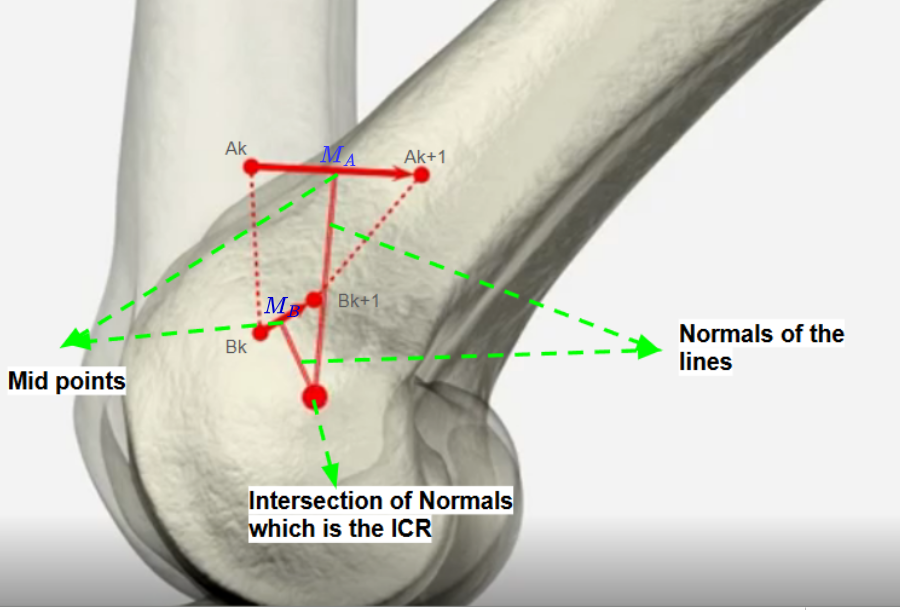
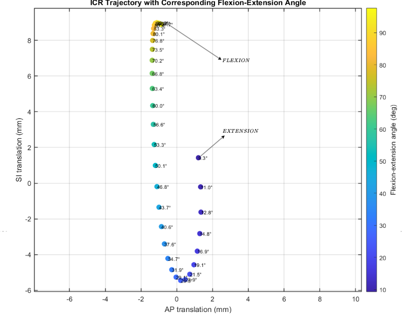
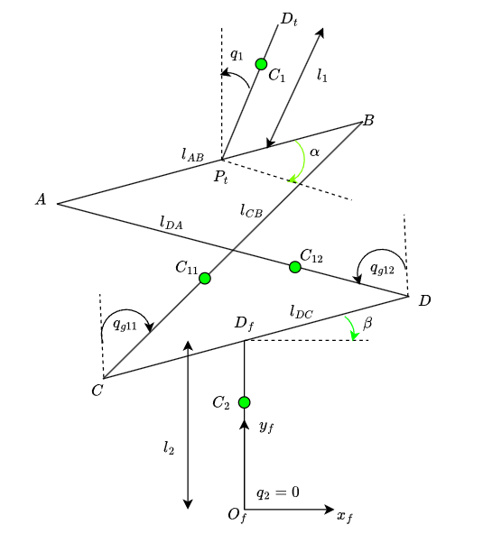
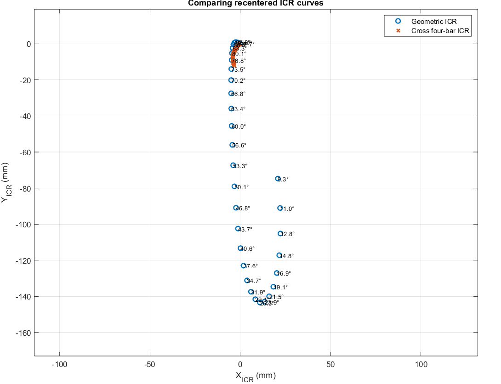
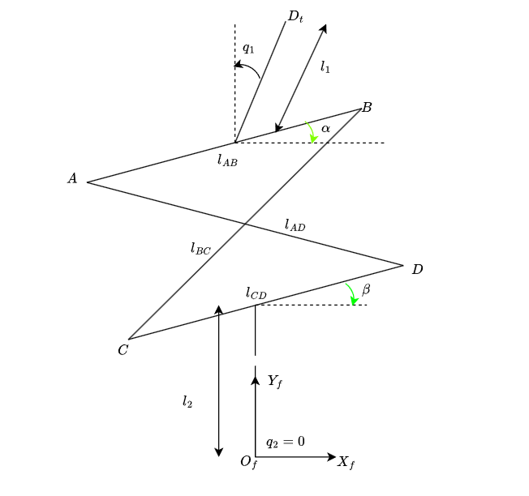
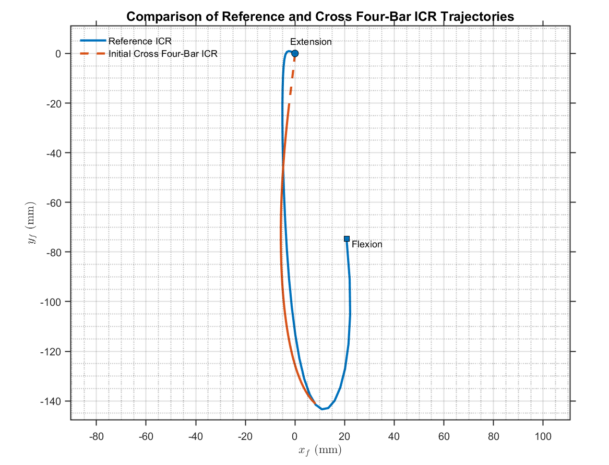

# Collaborative Robot-Based Test Bench for Knee Motion Simulation and ICR Estimation

**Master's Thesis — LS2N, École Centrale de Nantes**  
**February 2026 – August 2026**

This project was carried out as part of my Master's thesis at LS2N (Laboratoire des Sciences du Numérique de Nantes).

## Why This Project?

Meniscus repair techniques need to be mechanically evaluated before clinical use. At CHU Poitiers, repaired cadaveric knees are subjected to repeated gait-like flexion–extension cycles to evaluate the stability of the repair. A collaborative robot is used to provide controlled and repeatable cyclic motion during these experiments.

However, reproducing physiological knee motion with a robot is not straightforward. The human knee does not behave like a simple hinge with a fixed centre of rotation. During flexion and extension, the femur undergoes a combination of rolling and sliding relative to the tibia, causing the Instantaneous Centre of Rotation (ICR) to migrate throughout the motion.

## Problem Statement

In the existing robotic test setup, the knee motion is approximated using a fixed centre of rotation. An impedance-based compliant controller compensates for the difference between this fixed centre and the actual motion of the knee.

Although this compliance allows the robot to accommodate the motion, it also slows the flexion–extension cycle and increases the execution time of the experimental protocol.

The objective of my Master's thesis was therefore to estimate the migrating knee ICR and incorporate it into a velocity-based robot control strategy. The aim was to enable the robot to follow the changing centre of rotation during flexion–extension, reducing reliance on compliance and potentially shortening the execution time of the experimental protocol.

## Proposed Approach

The objective of this work was to develop a collaborative robot-based knee test bench capable of following the migrating knee ICR during flexion–extension.

The work was structured around four main questions:

1. **ICR Estimation** — Can the knee ICR trajectory be estimated from measured knee kinematic data?

2. **Cross Four-Bar Design** — Can the geometric parameters of a cross four-bar mechanism be optimised to reproduce the estimated ICR trajectory?

3. **Robot Control** — Can the Franka Research 3 (FR3) reproduce flexion–extension while following the moving ICR trajectory?

4. **Interaction Adaptation** — Can interaction-wrench information from repeated cycles be used to adapt the desired ICR trajectory?

## 1. ICR Estimation

### Reconstructing the Knee ICR

The first step was to determine how the centre of rotation of the knee changes during flexion–extension. I used tibiofemoral kinematic data from the University of Denver Living Kinematics of the Knee dataset (https://digitalcommons.du.edu/living_kinematics_knee/1/), measured using high-speed stereo radiography. The flexion–extension (FE) angle, together with the anterior–posterior (AP) and superior–inferior (SI) translations, was used to reconstruct the motion of the tibia in the sagittal plane.

To estimate the Instantaneous Centre of Rotation, I used the Reuleaux geometric method. Two reference points were considered rigidly attached to the tibia, and their positions were reconstructed at consecutive configurations. The perpendicular bisectors of their displacements intersect at the instantaneous centre of rotation.

  

  <em>Geometric estimation of the knee ICR using the Reuleaux method.</em>

Repeating this calculation throughout the motion produced a reference trajectory showing how the knee ICR migrates during flexion–extension.

  

  <em>Reference knee ICR trajectory reconstructed from the measured tibiofemoral kinematics.</em>

## 2. Cross Four-Bar Design and Optimisation

### From the Reference ICR to a Mechanism

Once the reference knee ICR trajectory had been reconstructed, the next challenge was to design a mechanism capable of reproducing a similar moving centre of rotation. A cross four-bar mechanism was selected because its instantaneous centre of rotation is defined by the intersection of its two crossed links and naturally changes as the mechanism moves.

By modifying the link lengths and geometric orientation of the mechanism, the resulting ICR trajectory can be shaped. This made it possible to formulate the mechanism design as an optimisation problem, where the objective was to find a geometry whose ICR trajectory closely approximated the reference knee ICR.

  

  <em>Kinematic model of the cross four-bar mechanism used for the design and optimisation.</em>

### Kinematic Model

I modelled the cross four-bar as a closed kinematic chain. For each prescribed flexion–extension angle, the loop-closure equations were solved to determine the dependent joint angles and therefore the complete mechanism configuration. The mechanism ICR was then obtained from the intersection of the crossed links.

Repeating this calculation over the complete flexion–extension range generated the ICR trajectory of a candidate mechanism. This trajectory could then be compared with the reference knee ICR obtained in the previous section.

### Why Optimisation Was Needed

Although a cross four-bar mechanism naturally generates a moving ICR, its trajectory depends strongly on the geometry of the mechanism. An arbitrary set of link lengths and orientations therefore does not necessarily reproduce the ICR trajectory observed in the human knee.

  

  <em>Comparison between the reference knee ICR and the ICR generated by the initial cross four-bar geometry.</em>

The mechanism geometry therefore had to be adjusted so that the generated ICR followed the reconstructed reference knee ICR as closely as possible. This led to an optimisation problem: finding the combination of geometric parameters that minimised the difference between the two trajectories while maintaining a feasible mechanism geometry.

### Mechanism Parameters

The cross four-bar geometry was defined by six design parameters: four link lengths (**l_dc, l_da, l_ab, l_cb**) and two orientation angles (**α, β**). These parameters determine the mechanism geometry and therefore the ICR trajectory generated during flexion–extension.

  

  <em>Geometric parameters used to define and optimise the cross four-bar mechanism.</em>

### Optimising the Mechanism Geometry

I used a Genetic Algorithm in MATLAB to search for the combination of the six geometric parameters that best reproduced the reference knee ICR. For each candidate geometry, the mechanism ICR trajectory was generated and compared with the reference trajectory, while geometric constraints were used to maintain a feasible mechanism configuration.

  

  <em>Reference knee ICR and ICR trajectory generated by the optimised cross four-bar mechanism.</em>

### Optimisation Result

The Genetic Algorithm reduced the contour RMSE between the mechanism-generated and reference knee ICR trajectories from approximately **8 mm ** to **3.28 mm** after optimisation.

### From Optimisation to Prototype

The optimised geometric parameters were used to design the final cross four-bar mechanism in SolidWorks. The mechanism was then manufactured and assembled for integration with the Franka Research 3 robotic test bench.

